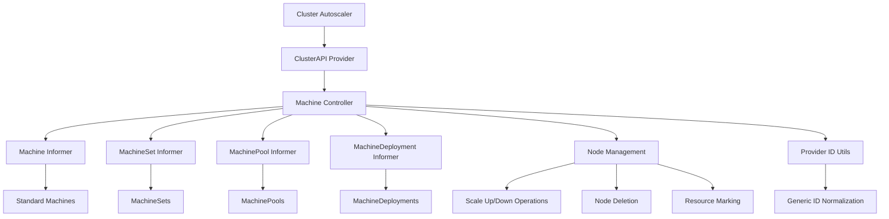
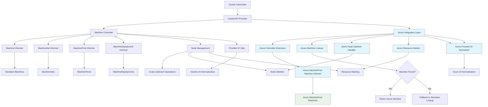
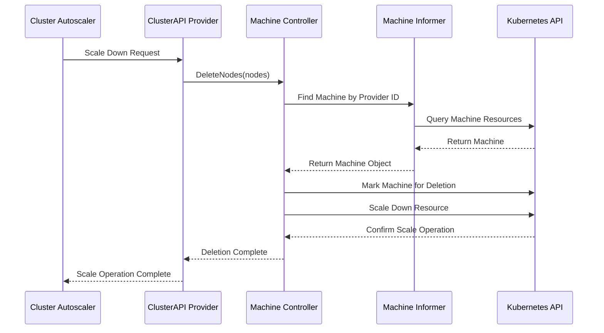
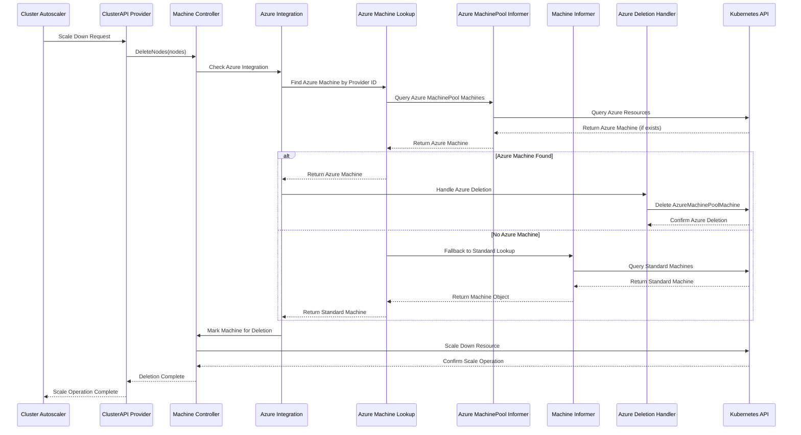

# FEAT001: Azure MachinePool Support Enhancement

## Type
**FEAT** (Feature) - Enhancement to support Azure Machine Pool Machines in ClusterAPI provider

## Objectives & Rationale

### Current State
The Cluster Autoscaler's ClusterAPI provider currently supports standard Cluster API Machine resources but lacks specific support for Azure Machine Pool Machines (AzureMachinePoolMachine). This creates limitations when working with Azure infrastructure where machine pools are managed through Azure-specific resources.

Current architecture handles:
- Standard Machines
- MachineSets 
- MachineDeployments
- MachinePools

### Future State
Enhanced ClusterAPI provider that supports AzureMachinePoolMachine resources alongside existing machine types, providing:
- Seamless integration with Azure Machine Pool infrastructure
- Proper resource discovery and management for Azure-specific machine pools
- Enhanced node deletion workflow that prevents race conditions
- Backward compatibility with existing machine management

### Benefits
- **Azure Users**: Better integration with Azure Machine Pool infrastructure
- **Platform Engineers**: More reliable autoscaling for Azure-based Kubernetes clusters
- **DevOps Teams**: Reduced operational complexity when managing Azure machine pools
- **System Reliability**: Prevention of race conditions during scaling operations

### Rationale
Azure Machine Pools require specialized handling due to their unique lifecycle management. Without proper support, scaling operations can result in race conditions where both the autoscaler and Azure's native scaling mechanisms attempt to delete nodes simultaneously, leading to over-deletion of nodes.

## Technical Specification

### Architecture Changes
The implementation introduces support for AzureMachinePoolMachine resources through:

1. **New Resource Constants**:
```go
const (
    azureMachinePoolMachineApiGroup     = "infrastructure.cluster.x-k8s.io"
    azureMachinePoolMachineApiVersion   = "v1beta1" 
    azureMachinePoolMachineKind         = "AzureMachinePoolMachine"
    resourceNameAzureMachinePoolMachine = "azuremachinepoolmachines"
)
```

2. **Enhanced Controller Structure**:
```go
type machineController struct {
    // existing fields...
    azureMachinePoolMachineInformer  informers.GenericInformer
    azureMachinePoolMachineResource  schema.GroupVersionResource
    azureMachinePoolMachineAvailable bool
}
```

3. **Fallback Resource Discovery**:
- Primary: Check for AzureMachinePoolMachine resources
- Fallback: Use standard Machine resources
- Error handling: Graceful degradation to existing functionality

### Provider ID Handling
Enhanced normalization for Azure provider IDs:
```go
func normalizedProviderString(s string) normalizedProviderID {
    if strings.HasPrefix(s, "azure://") {
        return normalizedProviderID(s)
    }
    // existing logic for other providers
}
```

### Build System Enhancements  
Multi-architecture Docker build support:
```makefile
docker buildx build --platform linux/$* --no-cache --pull
```

## Implementation Strategy

### Phase 1: Core Infrastructure Setup
1. **New Constants and Types**: Create new constants file for Azure-specific definitions
2. **Enhanced Controller Structure**: Extend machineController with new fields
3. **Resource Discovery**: Implement Azure resource detection with fallback

### Phase 2: Resource Management Enhancement  
1. **Informer Integration**: Add AzureMachinePoolMachine informer setup
2. **Indexing Enhancement**: Extend provider ID indexing for new resources
3. **Lookup Logic**: Implement fallback lookup mechanism

### Phase 3: Operational Logic
1. **Node Deletion Workflow**: Enhance deletion to handle Azure race conditions
2. **Resource Marking**: Extend marking/unmarking for new resource types
3. **Error Handling**: Implement robust error handling and recovery

### Phase 4: Build and Test Integration
1. **Multi-arch Builds**: Update Makefile for multi-architecture support
2. **Test Coverage**: Add comprehensive test coverage for new functionality
3. **Integration Testing**: Validate end-to-end workflows

## Implementation Plan

### Step 1: Create Azure-specific Constants File

**File**: `cluster-autoscaler/cloudprovider/clusterapi/azure_constants.go`

Create new file with Azure-specific constants to avoid modifying existing constants:

```go
package clusterapi

const (
    // Azure MachinePool Machine constants
    azureMachinePoolMachineApiGroup     = "infrastructure.cluster.x-k8s.io"
    azureMachinePoolMachineApiVersion   = "v1beta1"
    azureMachinePoolMachineKind         = "AzureMachinePoolMachine"
    resourceNameAzureMachinePoolMachine = "azuremachinepoolmachines"
)
```

**Rationale**: Creating new constants file preserves existing code paths while adding required Azure-specific definitions.

### Step 2: Extend Controller Structure

**File**: `cluster-autoscaler/cloudprovider/clusterapi/azure_controller_extension.go`

Create extended controller structure:

```go
package clusterapi

import (
    "k8s.io/client-go/informers"
    "k8s.io/apimachinery/pkg/runtime/schema"
)

// AzureControllerExtension extends machineController with Azure-specific capabilities
type AzureControllerExtension struct {
    azureMachinePoolMachineInformer  informers.GenericInformer
    azureMachinePoolMachineResource  schema.GroupVersionResource
    azureMachinePoolMachineAvailable bool
}

// NewAzureControllerExtension creates a new Azure controller extension
func NewAzureControllerExtension(
    managementInformerFactory dynamicinformer.DynamicSharedInformerFactory,
    managementDiscoveryClient discovery.DiscoveryInterface,
) (*AzureControllerExtension, error) {
    // Implementation details
}
```

### Step 3: Enhance Provider ID Utilities

**File**: `cluster-autoscaler/cloudprovider/clusterapi/azure_provider_utils.go`

Create Azure-specific provider ID utilities:

```go
package clusterapi

import "strings"

// AzureProviderIDNormalizer handles Azure-specific provider ID normalization
type AzureProviderIDNormalizer struct{}

// NormalizeProviderID normalizes Azure provider IDs
func (a *AzureProviderIDNormalizer) NormalizeProviderID(s string) normalizedProviderID {
    if strings.HasPrefix(s, "azure://") {
        return normalizedProviderID(s)
    }
    return normalizedProviderID("")
}

// IsAzureProviderID checks if provider ID is Azure-specific
func (a *AzureProviderIDNormalizer) IsAzureProviderID(s string) bool {
    return strings.HasPrefix(s, "azure://")
}
```

### Step 4: Enhanced Machine Lookup Logic

**File**: `cluster-autoscaler/cloudprovider/clusterapi/azure_machine_lookup.go`

Create fallback machine lookup functionality:

```go
package clusterapi

import (
    "k8s.io/apimachinery/pkg/apis/meta/v1/unstructured"
)

// AzureMachineLookup handles Azure-specific machine lookups with fallback
type AzureMachineLookup struct {
    controller *machineController
    extension  *AzureControllerExtension
}

// FindMachineByProviderID finds machine with Azure fallback logic
func (a *AzureMachineLookup) FindMachineByProviderID(providerID normalizedProviderID) (*unstructured.Unstructured, error) {
    var objs []interface{}
    var err error

    // First check for AzureMachinePoolMachine if available
    if a.extension.azureMachinePoolMachineAvailable {
        objs, err = a.extension.azureMachinePoolMachineInformer.Informer().GetIndexer().ByIndex(machineProviderIDIndex, string(providerID))
        if err != nil {
            return nil, err
        }
    }

    // Fallback to standard Machine lookup if no Azure machine found
    if len(objs) == 0 {
        objs, err = a.controller.machineInformer.Informer().GetIndexer().ByIndex(machineProviderIDIndex, string(providerID))
        if err != nil {
            return nil, err
        }
    }

    // Return first match with deep copy
    if len(objs) > 0 {
        return objs[0].(*unstructured.Unstructured).DeepCopy(), nil
    }
    return nil, nil
}
```

### Step 5: Enhanced Node Deletion Workflow

**File**: `cluster-autoscaler/cloudprovider/clusterapi/azure_node_deletion.go`

Create Azure-specific node deletion handler:

```go
package clusterapi

import (
    "context"
    corev1 "k8s.io/api/core/v1"
    metav1 "k8s.io/apimachinery/pkg/apis/meta/v1"
)

// AzureNodeDeletionHandler handles Azure-specific node deletion logic
type AzureNodeDeletionHandler struct {
    controller *machineController
    extension  *AzureControllerExtension
}

// HandleAzureMachinePoolDeletion handles Azure machine pool machine deletion
func (a *AzureNodeDeletionHandler) HandleAzureMachinePoolDeletion(
    machine *unstructured.Unstructured, 
    nodeGroup *nodegroup,
) error {
    // Check if machine is AzureMachinePoolMachine
    if machine.GetKind() != azureMachinePoolMachineKind {
        return nil // Not an Azure machine pool machine, skip
    }

    // Delete AzureMachinePoolMachine before scaling down pool
    err := a.controller.managementClient.Resource(a.extension.azureMachinePoolMachineResource).
        Namespace(machine.GetNamespace()).
        Delete(context.TODO(), machine.GetName(), metav1.DeleteOptions{})
    
    if err != nil {
        // Unmark machine for deletion on error
        _ = nodeGroup.scalableResource.UnmarkMachineForDeletion(machine)
        return err
    }
    
    return nil
}
```

### Step 6: Enhanced Resource Marking Logic

**File**: `cluster-autoscaler/cloudprovider/clusterapi/azure_resource_marking.go`

Create resource marking utilities with Azure support:

```go
package clusterapi

import (
    "context"
    "fmt"
    "time"
    
    "k8s.io/apimachinery/pkg/runtime/schema"
    metav1 "k8s.io/apimachinery/pkg/apis/meta/v1"
    "k8s.io/apimachinery/pkg/apis/meta/v1/unstructured"
)

// AzureResourceMarker handles resource marking for Azure machines
type AzureResourceMarker struct {
    controller *machineController
    extension  *AzureControllerExtension
}

// GetResourceGVR returns appropriate GroupVersionResource based on machine kind
func (a *AzureResourceMarker) GetResourceGVR(machine *unstructured.Unstructured) (schema.GroupVersionResource, error) {
    switch machine.GetKind() {
    case azureMachinePoolMachineKind:
        return a.extension.azureMachinePoolMachineResource, nil
    case machineKind:
        return a.controller.machineResource, nil
    default:
        return schema.GroupVersionResource{}, fmt.Errorf("unknown machine kind %s", machine.GetKind())
    }
}

// MarkMachineForDeletion marks machine for deletion with proper resource type
func (a *AzureResourceMarker) MarkMachineForDeletion(machine *unstructured.Unstructured) error {
    gvr, err := a.GetResourceGVR(machine)
    if err != nil {
        return err
    }

    u, err := a.controller.managementClient.Resource(gvr).
        Namespace(machine.GetNamespace()).
        Get(context.TODO(), machine.GetName(), metav1.GetOptions{})
    if err != nil {
        return err
    }

    annotations := u.GetAnnotations()
    if annotations == nil {
        annotations = make(map[string]string)
    }
    annotations[machineDeleteAnnotationKey] = time.Now().String()
    u.SetAnnotations(annotations)

    _, updateErr := a.controller.managementClient.Resource(gvr).
        Namespace(u.GetNamespace()).
        Update(context.TODO(), u, metav1.UpdateOptions{})

    return updateErr
}

// UnmarkMachineForDeletion removes deletion mark with proper resource type
func (a *AzureResourceMarker) UnmarkMachineForDeletion(machine *unstructured.Unstructured) error {
    gvr, err := a.GetResourceGVR(machine)
    if err != nil {
        return err
    }

    u, err := a.controller.managementClient.Resource(gvr).
        Namespace(machine.GetNamespace()).
        Get(context.TODO(), machine.GetName(), metav1.GetOptions{})
    if err != nil {
        return err
    }

    annotations := u.GetAnnotations()
    delete(annotations, machineDeleteAnnotationKey)
    u.SetAnnotations(annotations)

    _, updateErr := a.controller.managementClient.Resource(gvr).
        Namespace(u.GetNamespace()).
        Update(context.TODO(), u, metav1.UpdateOptions{})

    return updateErr
}
```

### Step 7: Integration Layer

**File**: `cluster-autoscaler/cloudprovider/clusterapi/azure_integration.go`

Create integration layer that coordinates all Azure components:

```go
package clusterapi

// AzureIntegration coordinates all Azure-specific functionality
type AzureIntegration struct {
    controller        *machineController
    extension         *AzureControllerExtension
    lookup            *AzureMachineLookup
    deletionHandler   *AzureNodeDeletionHandler
    resourceMarker    *AzureResourceMarker
    providerNormalizer *AzureProviderIDNormalizer
}

// NewAzureIntegration creates a new Azure integration instance
func NewAzureIntegration(controller *machineController) (*AzureIntegration, error) {
    extension, err := NewAzureControllerExtension(
        controller.managementInformerFactory,
        // discovery client needed here
    )
    if err != nil {
        return nil, err
    }

    integration := &AzureIntegration{
        controller: controller,
        extension:  extension,
    }

    integration.lookup = &AzureMachineLookup{
        controller: controller,
        extension:  extension,
    }

    integration.deletionHandler = &AzureNodeDeletionHandler{
        controller: controller,
        extension:  extension,
    }

    integration.resourceMarker = &AzureResourceMarker{
        controller: controller,
        extension:  extension,
    }

    integration.providerNormalizer = &AzureProviderIDNormalizer{}

    return integration, nil
}
```

### Step 8: Modify Existing Files - Controller Integration

**File**: `cluster-autoscaler/cloudprovider/clusterapi/clusterapi_controller.go`

Add conditional Azure integration to existing controller:

Add to `newMachineController` function:

```go
// Add Azure integration if available
azureIntegration, err := NewAzureIntegration(controller)
if err != nil {
    klog.V(4).Infof("Azure integration not available: %v", err)
} else {
    controller.azureIntegration = azureIntegration
}
```

Modify `findMachineByProviderID` method to use Azure lookup:

```go
func (c *machineController) findMachineByProviderID(providerID normalizedProviderID) (*unstructured.Unstructured, error) {
    // Try Azure lookup first if available
    if c.azureIntegration != nil {
        machine, err := c.azureIntegration.lookup.FindMachineByProviderID(providerID)
        if err != nil {
            return nil, err
        }
        if machine != nil {
            return machine, nil
        }
    }

    // Fallback to existing logic
    objs, err := c.machineInformer.Informer().GetIndexer().ByIndex(machineProviderIDIndex, string(providerID))
    if err != nil {
        return nil, err
    }
    // ... existing implementation
}
```

### Step 9: Modify Existing Files - Nodegroup Integration  

**File**: `cluster-autoscaler/cloudprovider/clusterapi/clusterapi_nodegroup.go`

Add Azure deletion handling to `DeleteNodes` method:

```go
func (ng *nodegroup) DeleteNodes(nodes []*corev1.Node) error {
    // ... existing code ...

    for _, node := range nodes {
        machine, err := ng.machineController.findMachineByProviderID(normalizedProviderString(node.Spec.ProviderID))
        if err != nil {
            return err
        }

        if err := nodeGroup.scalableResource.MarkMachineForDeletion(machine); err != nil {
            return err
        }

        // Handle Azure-specific deletion logic
        if ng.machineController.azureIntegration != nil {
            err := ng.machineController.azureIntegration.deletionHandler.HandleAzureMachinePoolDeletion(machine, ng)
            if err != nil {
                return err
            }
        }

        if err := ng.scalableResource.SetSize(replicas - 1); err != nil {
            _ = nodeGroup.scalableResource.UnmarkMachineForDeletion(machine)
            return err
        }
    }
    // ... rest of existing implementation
}
```

### Step 10: Modify Existing Files - Unstructured Resource Integration

**File**: `cluster-autoscaler/cloudprovider/clusterapi/clusterapi_unstructured.go`

Enhance marking methods to use Azure resource marker:

```go
func (r unstructuredScalableResource) MarkMachineForDeletion(machine *unstructured.Unstructured) error {
    // Use Azure resource marker if available
    if r.controller.azureIntegration != nil {
        return r.controller.azureIntegration.resourceMarker.MarkMachineForDeletion(machine)
    }

    // Fallback to existing implementation
    u, err := r.controller.managementClient.Resource(r.controller.machineResource).Namespace(machine.GetNamespace()).Get(context.TODO(), machine.GetName(), metav1.GetOptions{})
    // ... existing implementation
}

func (r unstructuredScalableResource) UnmarkMachineForDeletion(machine *unstructured.Unstructured) error {
    // Use Azure resource marker if available  
    if r.controller.azureIntegration != nil {
        return r.controller.azureIntegration.resourceMarker.UnmarkMachineForDeletion(machine)
    }

    // Fallback to existing implementation
    u, err := r.controller.managementClient.Resource(r.controller.machineResource).Namespace(machine.GetNamespace()).Get(context.TODO(), machine.GetName(), metav1.GetOptions{})
    // ... existing implementation
}
```

### Step 11: Modify Existing Files - Utils Integration

**File**: `cluster-autoscaler/cloudprovider/clusterapi/clusterapi_utils.go`

Enhance provider ID normalization:

```go
func normalizedProviderString(s string) normalizedProviderID {
    // Check for Azure provider ID first
    azureNormalizer := &AzureProviderIDNormalizer{}
    if azureNormalizer.IsAzureProviderID(s) {
        return azureNormalizer.NormalizeProviderID(s)
    }

    // Fallback to existing logic
    split := strings.Split(s, "/")
    return normalizedProviderID(split[len(split)-1])
}
```

### Step 12: Update Makefile - Multi-architecture Support

**File**: `cluster-autoscaler/Makefile`

Modify build targets to use buildx:

```makefile
make-image-arch-%:
ifdef BASEIMAGE
	docker buildx build --platform linux/$* --no-cache --pull --build-arg BASEIMAGE=${BASEIMAGE} \
		-t ${IMAGE}-$*:${TAG} \
		-f Dockerfile.$* .
else
	docker buildx build --platform linux/$* --no-cache --pull \
		-t ${IMAGE}-$*:${TAG} \
		-f Dockerfile.$* .
endif

docker-builder-arch-%:
	docker buildx build --platform linux/$* --no-cache -o type=docker --network=${DOCKER_NETWORK} -t autoscaling-builder-$* ../builder

build-in-docker-arch-%: clean-arch-% docker-builder-arch-%
	docker run --platform linux/$* ${RM_FLAG} -v `pwd`:/gopath/src/k8s.io/autoscaler/cluster-autoscaler/:Z autoscaling-builder-$*:latest \
		bash -c 'cd /gopath/src/k8s.io/autoscaler/cluster-autoscaler && BUILD_TAGS=${BUILD_TAGS} LDFLAGS="${LDFLAGS}" make build-arch-$*'
```

### Step 13: Add Comprehensive Tests

**File**: `cluster-autoscaler/cloudprovider/clusterapi/azure_integration_test.go`

Create comprehensive test suite:

```go
package clusterapi

import (
    "testing"
    "github.com/stretchr/testify/assert"
)

func TestAzureProviderIDNormalization(t *testing.T) {
    tests := []struct {
        name       string
        providerID string
        expected   normalizedProviderID
    }{
        {
            name:       "azure standard vm",
            providerID: "azure:///subscriptions/00000000-0000-0000-0000-000000000000/resourceGroups/resourceGroupName/providers/Microsoft.Compute/virtualMachines/control-plane-1cbe5-d4dx7",
            expected:   "azure:///subscriptions/00000000-0000-0000-0000-000000000000/resourceGroups/resourceGroupName/providers/Microsoft.Compute/virtualMachines/control-plane-1cbe5-d4dx7",
        },
        {
            name:       "azure vmss",
            providerID: "azure:///subscriptions/00000000-0000-0000-0000-000000000000/resourceGroups/resourceGroupName/providers/Microsoft.Compute/virtualMachineScaleSets/vmssName/virtualMachines/0",
            expected:   "azure:///subscriptions/00000000-0000-0000-0000-000000000000/resourceGroups/resourceGroupName/providers/Microsoft.Compute/virtualMachineScaleSets/vmssName/virtualMachines/0",
        },
    }

    for _, tc := range tests {
        t.Run(tc.name, func(t *testing.T) {
            normalizer := &AzureProviderIDNormalizer{}
            result := normalizer.NormalizeProviderID(tc.providerID)
            assert.Equal(t, tc.expected, result)
        })
    }
}

func TestAzureResourceMarking(t *testing.T) {
    // Test marking and unmarking Azure machines
    // Implementation details...
}

func TestAzureNodeDeletion(t *testing.T) {
    // Test Azure-specific node deletion workflow
    // Implementation details...
}
```

**File**: `cluster-autoscaler/cloudprovider/clusterapi/azure_controller_extension_test.go`

Test Azure controller extension functionality:

```go
package clusterapi

import (
    "testing"
)

func TestAzureControllerExtension(t *testing.T) {
    // Test Azure controller extension creation and functionality
}

func TestAzureMachineLookup(t *testing.T) {
    // Test fallback machine lookup logic
}
```

## Current Architecture Diagram



## Enhanced Architecture Diagram



## Data Flow Diagram - Current State



## Data Flow Diagram - Enhanced with Azure Support



## Verification & Testing Plan

### Unit Tests

#### 1. Azure Provider ID Normalization Tests
- **Objective**: Verify Azure provider IDs are correctly normalized
- **Test Cases**:
  - Azure standard VM provider IDs remain unchanged
  - Azure VMSS provider IDs remain unchanged
  - Non-Azure provider IDs use fallback logic
  - Empty and malformed provider IDs are handled gracefully

```go
func TestAzureProviderIDNormalization(t *testing.T) {
    testCases := []struct{
        input    string
        expected normalizedProviderID
    }{
        {"azure:///subscriptions/.../virtualMachines/vm1", "azure:///subscriptions/.../virtualMachines/vm1"},
        {"aws:///i-1234567", "i-1234567"},
        {"", ""},
    }
    // Implementation...
}
```

#### 2. Azure Machine Lookup Tests
- **Objective**: Verify fallback machine lookup functionality
- **Test Cases**:
  - AzureMachinePoolMachine found and returned
  - Fallback to standard Machine when Azure not found
  - Error handling for lookup failures
  - Proper deep copy of returned objects

```go
func TestAzureMachineLookup(t *testing.T) {
    // Test setup with mock informers
    // Test Azure machine found scenario
    // Test fallback scenario
    // Test error scenarios
}
```

#### 3. Azure Resource Marking Tests
- **Objective**: Verify correct resource marking based on machine kind
- **Test Cases**:
  - AzureMachinePoolMachine uses Azure GVR
  - Standard Machine uses Machine GVR
  - Unknown machine kinds return appropriate errors
  - Marking and unmarking operations succeed

```go
func TestAzureResourceMarking(t *testing.T) {
    // Test marking Azure machines
    // Test marking standard machines
    // Test error scenarios
    // Test annotation handling
}
```

#### 4. Azure Node Deletion Handler Tests
- **Objective**: Verify Azure-specific deletion workflow
- **Test Cases**:
  - AzureMachinePoolMachine deletion before pool scaling
  - Standard machines skip Azure deletion logic
  - Error handling and cleanup on failures
  - Proper context and timeout handling

```go
func TestAzureNodeDeletionHandler(t *testing.T) {
    // Test Azure machine deletion
    // Test standard machine handling
    // Test error scenarios and rollback
}
```

### Integration Tests

#### 1. End-to-End Azure Scaling Test
- **Objective**: Verify complete scaling workflow with Azure machines
- **Setup**: Create test cluster with Azure MachinePool
- **Test Steps**:
  1. Deploy pods that require scaling
  2. Verify Azure MachinePool machines are discovered
  3. Trigger scale-down operation
  4. Verify AzureMachinePoolMachine deletion occurs first
  5. Verify pool scaling completes successfully
  6. Verify no race conditions occurred

#### 2. Fallback Mechanism Test
- **Objective**: Verify fallback works when Azure resources unavailable
- **Setup**: Create test cluster without Azure resources
- **Test Steps**:
  1. Attempt Azure machine operations
  2. Verify fallback to standard machines
  3. Verify no errors or degradation
  4. Verify complete functionality maintained

#### 3. Mixed Environment Test
- **Objective**: Verify handling of mixed Azure and non-Azure machines
- **Setup**: Create cluster with both Azure and standard machines
- **Test Steps**:
  1. Verify both machine types discovered correctly
  2. Test scaling operations on both types
  3. Verify appropriate handling for each type
  4. Verify no cross-contamination of logic

### Performance Tests

#### 1. Lookup Performance Test
- **Objective**: Verify Azure lookup doesn't significantly impact performance
- **Metrics**: Response time, memory usage, CPU utilization
- **Test Scenarios**:
  - Large number of machines (1000+)
  - Mixed Azure and standard machines
  - High frequency lookups
- **Success Criteria**: <10ms increase in lookup time

#### 2. Scaling Performance Test  
- **Objective**: Verify scaling performance with Azure integration
- **Metrics**: Time to complete scaling operations
- **Test Scenarios**:
  - Scale up operations
  - Scale down operations  
  - Bulk operations (100+ nodes)
- **Success Criteria**: <5% increase in scaling time

### Compatibility Tests

#### 1. Kubernetes Version Compatibility
- **Objective**: Verify functionality across supported K8s versions
- **Test Matrix**: 
  - K8s 1.29.x, 1.30.x, 1.31.x, 1.32.x, 1.33.x
  - ClusterAPI v1beta1, v1alpha4
- **Success Criteria**: All tests pass on all versions

#### 2. Cloud Provider Compatibility
- **Objective**: Verify no impact on other cloud providers
- **Test Scenarios**:
  - AWS provider functionality unchanged
  - GCP provider functionality unchanged
  - Multi-cloud environments work correctly
- **Success Criteria**: Existing functionality preserved

### Error Handling Tests

#### 1. Azure API Failure Test
- **Objective**: Verify graceful handling of Azure API failures
- **Test Scenarios**:
  - Azure API timeouts
  - Azure API authentication failures
  - Azure resource not found errors
- **Success Criteria**: Proper error handling and fallback

#### 2. Resource Discovery Failure Test
- **Objective**: Verify handling when Azure resources unavailable
- **Test Scenarios**:
  - Azure CRDs not installed
  - Azure informers fail to start
  - Permission issues accessing Azure resources
- **Success Criteria**: Fallback to standard functionality

### Regression Tests

#### 1. Existing Functionality Preservation
- **Objective**: Verify no regression in existing functionality
- **Test Coverage**:
  - All existing unit tests pass
  - All existing integration tests pass
  - Performance benchmarks maintained
- **Success Criteria**: 100% existing test passage

#### 2. Configuration Backward Compatibility
- **Objective**: Verify existing configurations continue working
- **Test Scenarios**:
  - Existing ClusterAPI configurations
  - Existing autoscaling policies
  - Existing resource annotations
- **Success Criteria**: No configuration changes required

## Rollback Plan

### Immediate Rollback Triggers

1. **Critical Test Failures**:
   - Any existing functionality regression
   - Performance degradation >20%
   - Security vulnerabilities introduced

2. **Production Issues**:
   - Cluster autoscaling failures
   - Resource deletion failures  
   - Memory leaks or crashes

3. **Compatibility Issues**:
   - Kubernetes version incompatibilities
   - ClusterAPI version conflicts
   - Cloud provider conflicts

### Rollback Procedure

#### Step 1: Immediate Actions (0-15 minutes)
1. **Stop Deployments**: Halt any ongoing rollouts of new version
2. **Assessment**: Identify scope and impact of issues
3. **Communication**: Notify stakeholders of rollback initiation
4. **Backup Verification**: Ensure backup systems are operational

#### Step 2: Code Rollback (15-30 minutes)
1. **Revert Commits**: 
   ```bash
   git revert <commit-hash-range>
   git push origin main
   ```
2. **Remove New Files**:
   - Delete `azure_*.go` files created during implementation
   - Remove Azure-specific test files
   - Clean up any generated artifacts

3. **Restore Modified Files**:
   - Revert changes to `clusterapi_controller.go`
   - Revert changes to `clusterapi_nodegroup.go`  
   - Revert changes to `clusterapi_unstructured.go`
   - Revert changes to `clusterapi_utils.go`
   - Revert changes to `Makefile`

#### Step 3: Build and Test Rollback (30-45 minutes)
1. **Clean Build**: Remove all build artifacts and rebuild
2. **Quick Verification**: Run critical path tests
3. **Image Building**: Create rollback container images
4. **Registry Update**: Push rollback images to registries

#### Step 4: Deployment Rollback (45-60 minutes)  
1. **Staging Deployment**: Deploy rollback to staging environment
2. **Staging Verification**: Verify core functionality restored
3. **Production Deployment**: Deploy to production environments
4. **Health Checks**: Verify system health and functionality

#### Step 5: Verification and Monitoring (60-120 minutes)
1. **Functionality Tests**: Run comprehensive test suite
2. **Performance Monitoring**: Verify performance restored to baseline
3. **Error Monitoring**: Ensure error rates return to normal
4. **User Verification**: Confirm user-reported issues resolved

#### Step 6: Post-Rollback Actions (2+ hours)
1. **Root Cause Analysis**: Investigate what went wrong
2. **Documentation**: Document rollback process and lessons learned
3. **Process Improvement**: Update testing and deployment procedures
4. **Communication**: Notify stakeholders of resolution

### Rollback Verification Checklist

- [ ] All new Azure-specific files removed
- [ ] All modified files reverted to original state
- [ ] Build system restored to original configuration
- [ ] Container images rebuilt and deployed
- [ ] Core autoscaling functionality verified
- [ ] Performance metrics returned to baseline
- [ ] No new errors in logs
- [ ] Existing ClusterAPI configurations still work
- [ ] All supported cloud providers functional
- [ ] Kubernetes API interactions normal
- [ ] Resource scaling operations successful
- [ ] Node lifecycle management working
- [ ] Monitoring and alerting functional

### Rollback Testing

#### Critical Path Tests
1. **Basic Scaling**: Verify scale up/down operations
2. **Node Lifecycle**: Verify node creation and deletion
3. **Resource Discovery**: Verify machine and node discovery
4. **Provider Integration**: Verify cloud provider functionality
5. **Configuration Loading**: Verify configuration parsing
6. **API Interactions**: Verify Kubernetes API calls

#### Performance Validation
1. **Response Times**: Verify API response times normal
2. **Memory Usage**: Verify memory consumption baseline
3. **CPU Usage**: Verify CPU utilization normal
4. **Scaling Speed**: Verify scaling operation timing
5. **Resource Utilization**: Verify overall resource usage

### Emergency Contacts and Procedures

#### Escalation Path
1. **Level 1**: Development team and immediate supervisor
2. **Level 2**: Platform engineering lead and SRE team  
3. **Level 3**: Engineering management and product owner
4. **Level 4**: Senior leadership and incident commander

#### Communication Channels
- Primary: Slack #cluster-autoscaler-incidents
- Secondary: Email distribution list
- Emergency: Phone tree activation
- Public: Status page updates (if user-facing)

#### Documentation Requirements
- Incident timeline and actions taken
- Root cause analysis findings
- Process improvements identified  
- Lessons learned documentation
- Updated runbooks and procedures

This comprehensive rollback plan ensures that any issues encountered during implementation can be quickly and safely resolved, maintaining system stability and user experience.
